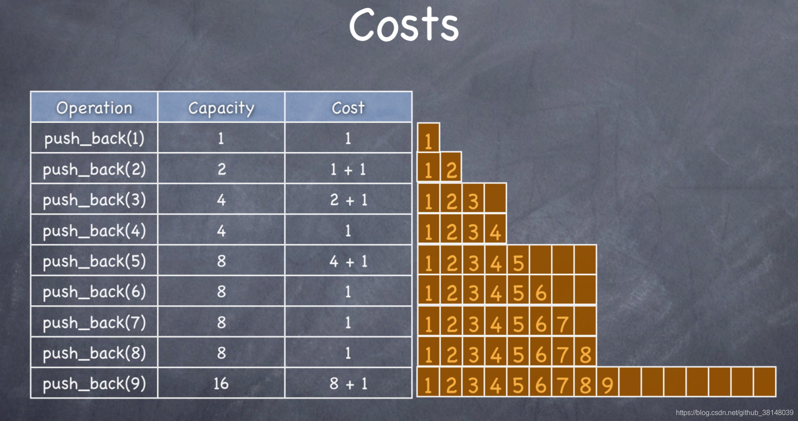
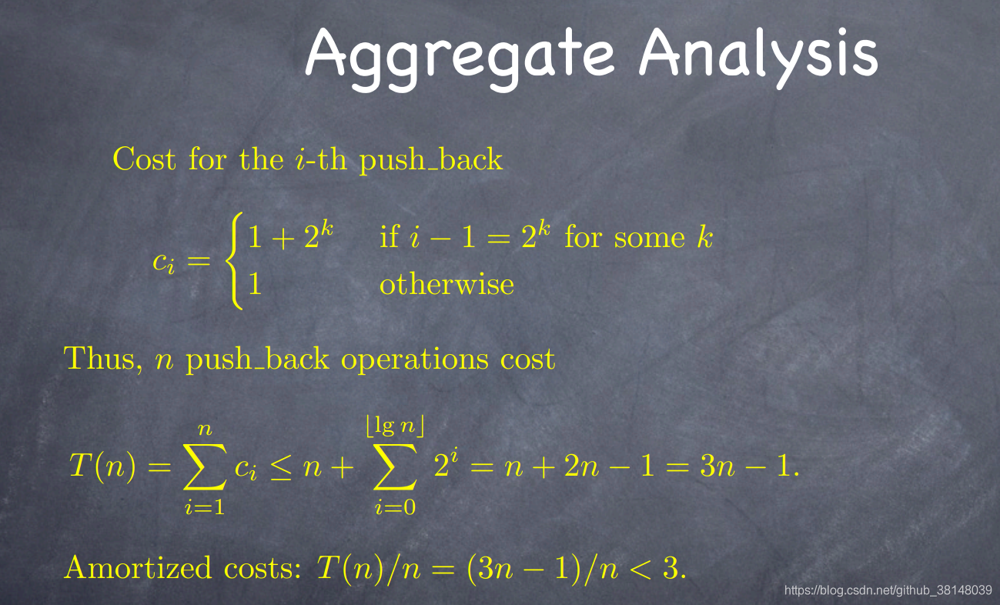
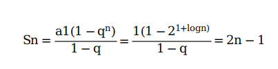

# c++相关问题
## 智能指针
1. unique_ptr的独占所有权？怎么转移unique_ptr的所有权？
    unique_ptr对象始终是关联的原始指针的唯一所有者。我们无法复制unique_ptr对象，它只能移动。
    由于每个unique_ptr对象都是原始指针的唯一所有者，因此在其析构函数中它直接删除关联的指针，不需要任何参考计数。
    std::move() 将把 待转换的智能指针 转换为一个右值引用。因此，调用 unique_ptr 的移动构造函数，并将关联的原始指针传输到 新的智能指针。在转移完原始指针的所有权后， 待转换的智能指针将变为空。
2. b = a; 怎么实现？b = move(a); 怎么实现？

    移动构造函数的流程：
    定义一个空的构造函数方法，该方法采用一个对类类型的右值引用作为参数，如以下示例所示：
    ```C++
    //复制
    MemoryBlock(MemoryBlock&& other)
    : _data(nullptr)
    , _length(0)
    {
    }
    ```
    在移动构造函数中，将源对象中的类数据成员添加到要构造的对象：

    ```C++
    复制
    _data = other._data;
    _length = other._length;
    ```
    将源对象的数据成员分配给默认值。 这可以防止析构函数多次释放资源（如内存）:
    ```C++
    复制
    other._data = nullptr;
    other._length = 0;
    ```
    移动复制运算符：
    定义一个空的赋值运算符，该运算符采用一个对类类型的右值引用作为参数并返回一个对类类型的引用，如以下示例所示：
    - 在移动赋值运算符中，如果尝试将对象赋给自身，则添加不执行运算的条件语句。
    - 在条件语句中，从要将其赋值的对象中释放所有资源（如内存）。
    - 执行第一个过程中的步骤 2 和步骤 3 以将数据成员从源对象转移到要构造的对象：
    - 返回对当前对象的引用，如以下示例所示：

3. shared_ptr是如何实现共享权的？引用计数和管理的内存地址怎么实现的？是同一块内存空间吗？
    引用计数。C++ 智能指针底层是采用引用计数的方式实现的。简单的理解，智能指针在申请堆内存空间的同时，会为其配备一个整形值（初始值为 1），每当有新对象使用此堆内存时，该整形值 +1；反之，每当使用此堆内存的对象被释放时，该整形值减 1。当堆空间对应的整形值为 0 时，即表明不再有对象使用它，该堆空间就会被释放掉。引用计数和管理的对象都放在堆空间。

4. shared_ptr的一些函数的实现？
    ``` C++
    /*移动语义*/
    //移动构造函数
    my_shared_ptr(my_shared_ptr && dying_obj): 
    m_ptr(nullptr),
    m_ref_count(nullptr)
    {
        //初始化后交换指针和引用计数, 等于清除了原shared_ptr的内容
        dying_obj.swap(*this);
    }

    //移动赋值运算符
    my_shared_ptr & operator=(my_shared_ptr && dying_obj)
    {
        //my_shared_ptr(std::move(dying_obj))用移动构造函数创建出一个新的shared_ptr(此时dying_obj的内容被清除了)
        //再和this交换指针和引用计数
        //因为this的内容被交换到了当前的临时创建的my_shared_ptr里，原this指向的引用计数-1
        my_shared_ptr(std::move(dying_obj)).swap(*this);
        return *this;
    }

    void swap(my_shared_ptr & other)
    {
        std::swap(m_ptr, other.m_ptr);
        std::swap(m_ref_count, other.m_ref_count);
    }
    ```
5. weak_ptr有什么作用？

    weak_ptr的出现是为了解决shared_ptr的循环引用的问题。例如有一个两个节点的双链表，节点分别由两个shared_ptr来实现。这个时候就会出现循环引用的问题，导致删除节点的时候，shared_ptr无法自动析构回收该节点。
    weak_ptr的构造析构不会影响引用计数的大小，当我们采用这种方式时，sp1和sp2的引用计数始终为1，当我们想销毁时就可以随意操作啦！

## 虚函数
1. 虚函数可以使内联的吗？

    虚函数可以是内联函数，内联是可以修饰虚函数的，但是当虚函数表现多态性的时候不能内联。


## 模板
### 1.模板的特化？
一个特定参数集合自定义当前模板，类模板和函数模板都可以全特化。 全特化的模板参数列表应当是空的。


### 1.四大转换cast
#### (1) static_cast
```c++
static_cast<type_id>(expression)
```
该运算符把expression转换为type-id类型，但没有运行时类型检查来保证转换的安全性
#### (2) const_cast
const_cast可以去除表达式的const的属性
#### （3） dynamic_cast
dynamic_cast 支持运行时识别指针或引用所指向的对象。
#### （4）reinterpret_cast
reinterpret_cast该运算符把expression重新解释成type-id类型的对象。对象在这里的范围包括变量以及实现类的对象。

## 一些函数
### 1. 说一说memcpy和memmove？
memcpy和memmove都是拷贝一定长度内存的接口函数。区别在于：当发生内存冲突时，memcpy不能解决这个问题。而memmove不受影响，因为它在这种情况下，会逆序的复制内存中数据。


## STL
### vector的扩容原理？以及vector的push_back的均摊时间复杂度？
该函数首先检查是否还有备用空间，如果有就直接在备用空间上构造元素，并调整迭代器 finish，使 vector变大。如果没有备用空间了，就扩充空间，重新配置、移动数据，释放原空间。​其中​判断是否有备用空间,就是判断 finish是否与 end_of_storage 相等.如果 finish != end_of_storage，说明还有备用空间，否则已无备用空间。
当执行 push_back 操作，该 vector 需要分配更多空间时，它的容量(capacity)会增大到原来的 m 倍。​现在我们来均摊分析方法来计算 push_back 操作的时间复杂度。




## 其他
1. 说说一致性hash?

    https://segmentfault.com/a/1190000021199728.

    服务器节点增加或者减少，使用传统的hash算法会造成节点编号的变化，导致客户端映射到服务器错误。但对于分布式缓存这种的系统而言，映射规则失效就意味着之前缓存的失效，若同一时刻出现大量的缓存失效，则可能会出现 “缓存雪崩”，这将会造成灾难性的后果。将对象和服务器都放置到同一个哈希环后，在哈希环上顺时针查找距离这个对象的 hash 值最近的机器，即是这个对象所属的机器。而使用一致性哈希算法后，这种情况得到了较大的改善，因为只有少部分对象需要重新分配。

2. C++ 的 new 运算符流程?

    1）调用operator new分配内存 ；
    2）调用构造函数生成类对象；
    3）返回相应指针。

3. 什么是栈溢出，什么时候会发生栈溢出？

    栈数据结构满溢，无法存放更多的数据。当出现死循环或者递归调用的过深就会发生栈溢出。函数递归调用时，内核需要在栈中自动保存函数调用时的现场和变量。

4. lambda表达式？
    lambda表达式是c++11的新特性。lambda表达式可以理解为一种匿名函数，可以用来捕获一定范围的变量。
    其有如下形式：
    捕获列表+ 参数列表+ 函数可选项->返回值类型+函数主体。


