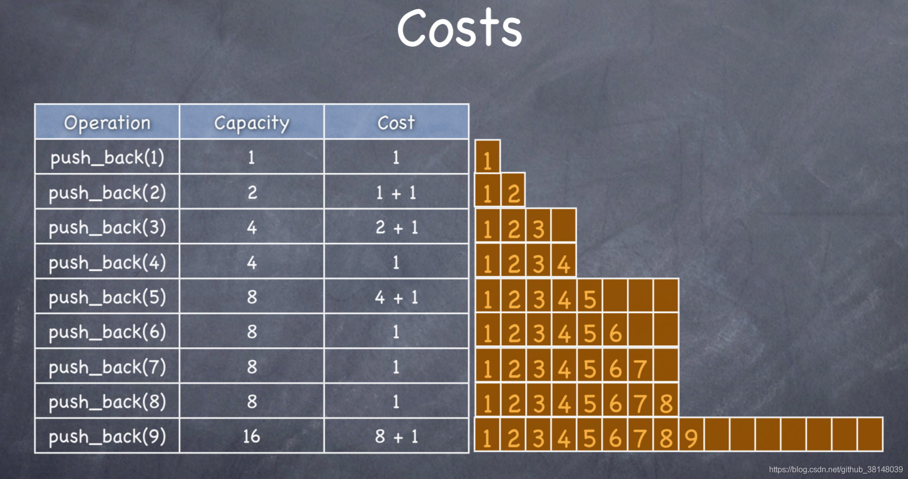
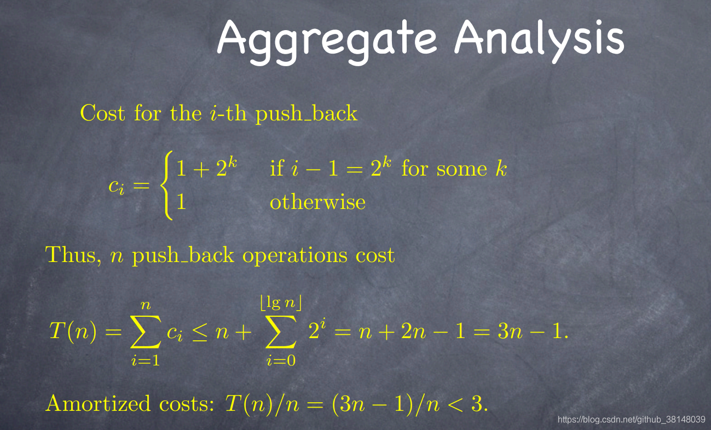
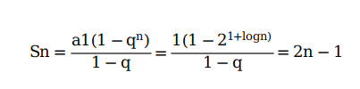

# c++相关问题
## 智能指针
1. unique_ptr的独占所有权？怎么转移unique_ptr的所有权？
    unique_ptr对象始终是关联的原始指针的唯一所有者。我们无法复制unique_ptr对象，它只能移动。
    由于每个unique_ptr对象都是原始指针的唯一所有者，因此在其析构函数中它直接删除关联的指针，不需要任何参考计数。
    std::move() 将把 待转换的智能指针 转换为一个右值引用。因此，调用 unique_ptr 的移动构造函数，并将关联的原始指针传输到 新的智能指针。在转移完原始指针的所有权后， 待转换的智能指针将变为空。
2. b = a; 怎么实现？b = move(a); 怎么实现？

    移动构造函数的流程：
    定义一个空的构造函数方法，该方法采用一个对类类型的右值引用作为参数，如以下示例所示：
    ```C++
    //复制
    MemoryBlock(MemoryBlock&& other)
    : _data(nullptr)
    , _length(0)
    {
    }
    ```
    在移动构造函数中，将源对象中的类数据成员添加到要构造的对象：

    ```C++
    复制
    _data = other._data;
    _length = other._length;
    ```
    将源对象的数据成员分配给默认值。 这可以防止析构函数多次释放资源（如内存）:
    ```C++
    复制
    other._data = nullptr;
    other._length = 0;
    ```
    移动复制运算符：
    定义一个空的赋值运算符，该运算符采用一个对类类型的右值引用作为参数并返回一个对类类型的引用，如以下示例所示：
    - 在移动赋值运算符中，如果尝试将对象赋给自身，则添加不执行运算的条件语句。
    - 在条件语句中，从要将其赋值的对象中释放所有资源（如内存）。
    - 执行第一个过程中的步骤 2 和步骤 3 以将数据成员从源对象转移到要构造的对象：
    - 返回对当前对象的引用，如以下示例所示：

3. shared_ptr是如何实现共享权的？引用计数和管理的内存地址怎么实现的？是同一块内存空间吗？
    引用计数。C++ 智能指针底层是采用引用计数的方式实现的。简单的理解，智能指针在申请堆内存空间的同时，会为其配备一个整形值（初始值为 1），每当有新对象使用此堆内存时，该整形值 +1；反之，每当使用此堆内存的对象被释放时，该整形值减 1。当堆空间对应的整形值为 0 时，即表明不再有对象使用它，该堆空间就会被释放掉。引用计数和管理的对象都放在堆空间。

4. shared_ptr的一些函数的实现？
    ``` C++
    /*移动语义*/
    //移动构造函数
    my_shared_ptr(my_shared_ptr && dying_obj): 
    m_ptr(nullptr),
    m_ref_count(nullptr)
    {
        //初始化后交换指针和引用计数, 等于清除了原shared_ptr的内容
        dying_obj.swap(*this);
    }

    //移动赋值运算符
    my_shared_ptr & operator=(my_shared_ptr && dying_obj)
    {
        //my_shared_ptr(std::move(dying_obj))用移动构造函数创建出一个新的shared_ptr(此时dying_obj的内容被清除了)
        //再和this交换指针和引用计数
        //因为this的内容被交换到了当前的临时创建的my_shared_ptr里，原this指向的引用计数-1
        my_shared_ptr(std::move(dying_obj)).swap(*this);
        return *this;
    }

    void swap(my_shared_ptr & other)
    {
        std::swap(m_ptr, other.m_ptr);
        std::swap(m_ref_count, other.m_ref_count);
    }
    ```
5. weak_ptr有什么作用？

    weak_ptr的出现是为了解决shared_ptr的循环引用的问题。例如有一个两个节点的双链表，节点分别由两个shared_ptr来实现。这个时候就会出现循环引用的问题，导致删除节点的时候，shared_ptr无法自动析构回收该节点。
    weak_ptr的构造析构不会影响引用计数的大小，当我们采用这种方式时，sp1和sp2的引用计数始终为1，当我们想销毁时就可以随意操作啦！

## 虚函数
### 1. 虚函数可以使内联的吗？
    虚函数可以是内联函数，内联是可以修饰虚函数的，但是当虚函数表现多态性的时候不能内联。

### 2. 说说c++ move函数？
move是转移对象的所有权，所以我们可以move的是可以转移所有权的对象。
C++，我们可以移动右值，也可以把左值通过std::move变成右值，从而可以实现移动。

### 3. 说说c++的左值和右值？什么时候用到右值？
在C++11中所有的值必属于左值、右值两者之一，右值又可以细分为纯右值、将亡值。在C++11中可以取地址的、有名字的就是左值，反之，不能取地址的、没有名字的就是右值（将亡值或纯右值）。
C++11正是通过引入右值引用来优化性能，具体来说是通过移动语义来避免无谓拷贝的问题，通过move语义来将临时生成的左值中的资源无代价的转移到另外一个对象中去，通过完美转发来解决不能按照参数实际类型来转发的问题（同时，完美转发获得的一个好处是可以实现移动语义）。
## 模板
### 1.模板的特化？
一个特定参数集合自定义当前模板，类模板和函数模板都可以全特化。 全特化的模板参数列表应当是空的。


### 1.四大转换cast
#### (1) static_cast
```c++
static_cast<type_id>(expression)
```
该运算符把expression转换为type-id类型，但没有运行时类型检查来保证转换的安全性
#### (2) const_cast
const_cast可以去除表达式的const的属性
#### （3） dynamic_cast
dynamic_cast 支持运行时识别指针或引用所指向的对象。
#### （4）reinterpret_cast
reinterpret_cast该运算符把expression重新解释成type-id类型的对象。对象在这里的范围包括变量以及实现类的对象。

## 一些函数
### 1. 说一说memcpy和memmove？
memcpy和memmove都是拷贝一定长度内存的接口函数。区别在于：当发生内存冲突时，memcpy不能解决这个问题。而memmove不受影响，因为它在这种情况下，会逆序的复制内存中数据。


## STL
### vector的扩容原理？以及vector的push_back的均摊时间复杂度？
该函数首先检查是否还有备用空间，如果有就直接在备用空间上构造元素，并调整迭代器 finish，使 vector变大。如果没有备用空间了，就扩充空间，重新配置、移动数据，释放原空间。​其中​判断是否有备用空间,就是判断 finish是否与 end_of_storage 相等.如果 finish != end_of_storage，说明还有备用空间，否则已无备用空间。
当执行 push_back 操作，该 vector 需要分配更多空间时，它的容量(capacity)会增大到原来的 m 倍。​现在我们来均摊分析方法来计算 push_back 操作的时间复杂度。




## 其他
1. 说说一致性hash?

    https://segmentfault.com/a/1190000021199728.

    服务器节点增加或者减少，使用传统的hash算法会造成节点编号的变化，导致客户端映射到服务器错误。但对于分布式缓存这种的系统而言，映射规则失效就意味着之前缓存的失效，若同一时刻出现大量的缓存失效，则可能会出现 “缓存雪崩”，这将会造成灾难性的后果。将对象和服务器都放置到同一个哈希环后，在哈希环上顺时针查找距离这个对象的 hash 值最近的机器，即是这个对象所属的机器。而使用一致性哈希算法后，这种情况得到了较大的改善，因为只有少部分对象需要重新分配。

2. C++ 的 new 运算符流程?

    1）调用operator new分配内存 ；
    2）调用构造函数生成类对象；
    3）返回相应指针。

3. 什么是栈溢出，什么时候会发生栈溢出？

    栈数据结构满溢，无法存放更多的数据。当出现死循环或者递归调用的过深就会发生栈溢出。函数递归调用时，内核需要在栈中自动保存函数调用时的现场和变量。

4. lambda表达式？
    lambda表达式是c++11的新特性。lambda表达式可以理解为一种匿名函数，可以用来捕获一定范围的变量。
    其有如下形式：
    捕获列表+ 参数列表+ 函数可选项->返回值类型+函数主体。


1.C++ 的新特性有哪些？

 智能指针、右值引用、移动语义、Lambda表达式，初始化列表语法等

	2. 说一说C++ 中哪些函数不能是虚函数？

普通函数
普通函数（非成员函数）只能被overload，不能被override，而且编译器会在编译时绑定函数。
多态的运行期行为体现在虚函数上，虚函数通过继承方式来体现出多态作用，顶层函数不属于成员函数，是不能被继承的
构造函数
因为构造函数本来就是为了明确初始化对象成员才产生的，然而virtual function主要是为了在不完全了解细节的情况下也能正确处理对象。另外，virtual函数是在不同类型的对象产生不同的动作，现在对象还没有产生，如何使用virtual函数来完成你想完成的动作。
内联成员函数
内联函数就是为了在代码中直接展开，减少函数调用花费的代价，虚函数是为了在继承后对象能够准确的执行自己的动作，这是不可能统一的。
静态成员函数
静态成员函数对于每个类来说只有一份代码，所有的对象都共享这一份代码，他也没有要动态邦定的必要性。不能被继承，只属于该类。
友元函数
C++不支持友元函数的继承，对于没有继承特性的函数没有虚函数的说法。友元函数不属于类的成员函数，不能被继承。

3.说说C++中面向对象？

 面向对象思想的特点： - 是一种更符合人类思维习惯的思想 - 可以将复杂的问题简单化 - 将我们从执行者变成了指挥者 3. 面向对象的三大特征：封装、继承、多态 - 封装：将事物属性和行为封装到一起，也就是 C++ 中的类，便于管理，提高代码的复用性。事物的属性和行为分别对应类中的成员变量和成员方法。 - 继承：继承使类与类之间产生关系，能够提高代码的复用性以及可维护性。 - 多态：多态意味着调用成员函数时，会根据调用方法的对象的类型来执行不同的函数。 加分回答 面向过程和面向对象解决问题举例：以洗衣服为例。 1. 面向过程：接水到盆中 —— 放入衣服 —— 加入洗衣粉 —— 浸泡 —— 搓衣服 —— 过水 —— 拧干 —— 晾干 2. 面向对象：将衣服放入洗衣机 —— 加入洗衣粉 —— 开启 —— 晾干 通过例子可以发现面向对象的方式解决问题更加简单一些，但是面向对象还是基于面向过程的


4.C++ 多态的实现

多态就是多种形态，C++的多态分为静态多态与动态多态。

静态多态就是重载和函数模板，因为在编译期确定，所以称为静态多态。在编译时就可以确定函数地址。

动态多态就是通过继承重写基类的虚函数实现的多态，因为是在运行时确定，所以称为动态多态。运行时在虚函数表中寻找调用函数的地址。

     在基类的函数前加上virtual关键字，在派生类中重写该函数，运行时将会根据对象的实际类型来调用相应的函数。

如果对象类型是子类，就调用子类的函数；如果对象类型是父类，就调用父类的函数，（即指向父类调父类，指向子类调子类）此为多态的表现。

5. C++ 多态实现原理

1. 用virtual关键字申明的函数叫做虚函数，虚函数肯定是类的成员函数。

2. 存在虚函数的类都有一个一维的虚函数表叫做虚表。当类中声明虚函数时，编译器会在类中生成一个虚函数表。

3. 类的对象有一个指向虚表开始的虚指针。虚表是和类对应的，虚表指针是和对象对应的。
	
4. 虚函数表是一个存储类成员函数指针的数据结构。

5. 虚函数表是由编译器自动生成与维护的。

6. virtual成员函数会被编译器放入虚函数表中。

7. 当存在虚函数时，每个对象中都有一个指向虚函数的指针（C++编译器给父类对象，子类对象提前布局vptr指针），当进行test(parent *base)函数的时候，C++编译器不需要区分子类或者父类对象，只需要再base指针中，找到vptr指针即可）。

8. vptr一般作为类对象的第一个成员。
————————————————

6.关于虚函数的一些问题

为什么调用普通函数比调用虚函数的效率高？
因为普通函数是静态联编的，而调用虚函数是动态联编的。

联编的作用：程序调用函数，编译器决定使用哪个可执行代码块。

静态联编 ：在编译的时候就确定了函数的地址，然后call就调用了。
动态联编 ： 首先需要取到对象的首地址，然后再解引用取到虚函数表的首地址后，再加上偏移量才能找到要调的虚函数，然后call调用。
明显动态联编要比静态联编做的操作多，肯定就费时间。

为什么要用虚函数表（存函数指针的数组）？

实现多态，父类对象的指针指向父类对象调用的是父类的虚函数，指向子类调用的是子类的虚函数。
同一个类的多个对象的虚函数表是同一个，所以这样就可以节省空间，一个类自己的虚函数和继承的虚函数还有重写父类的虚函数都会存在自己的虚函数表。

为什么要把基类的析构函数定义为虚函数？

在用基类操作派生类时，为了防止执行基类的析构函数，不执行派生类的析构函数。因为这样的删除只能够删除基类对象, 而不能删除子类对象, 形成了删除一半形象, 会造成内存泄漏.如下代码：
```C++
#include<iostream>  
using namespace std;  
  
class Base  
{  
public:  
    Base() {};  
    ~Base()   
    {  
        cout << "delete Base" << endl;  
    };  
};  
  
class Derived : public Base  
{  
public:  
    Derived() {};  
    ~Derived()  
    {  
        cout << "delete Derived" << endl;  
  
    };  
};  
int main()  
{  
    //操作1  
    Base* p1 = new Derived;  
    delete p1;  
    //因为这里子类的析构函数重写了父类的析构函数，虽然子类和父类的析构函数名不一样，  
    //但是编译器对析构函数做了特殊的处理，在内部子类和父类的析构函数名是一样的。  
    //所以如果不把父类的析构函数定义成虚函数，就不构成多态，由于父类的析构函数隐藏了子类  
    //的析构函数，所以只能调到父类的析构函数。  
    //但是若把父类的析构函数定义成虚函数，那么调用时就会直接调用子类的析构函数，  
    //由于子类析构先要去析构父类，在析构子类，这样就把子类和继承的父类都析构了  
  
    system("pause");  
}  
```
为什么子类和父类的函数名不一样，还可以构成重写呢？
因为编译器对析构函数的名字做了特殊处理，在内部函数名是一样的。
————————————————
版权声明：本文为CSDN博主「程序猿王老铁」的原创文章，遵循CC 4.0 BY-SA版权协议，转载请附上原文出处链接及本声明。
原文链接：https://blog.csdn.net/qq_40840459/article/details/80195158

7、指针和引用的区别？

1、两者的定义和性质不同
指针是一个变量，存储的是一个地址，指向内存的一个存储单元；引用是原变量的一个别名，跟原来的变量实质上是同一个东西。

2、指针可以有多级，引用只能是一级

3、指针可以在定义的时候不初始化，引用必须在定义的时候初始化

4、指针可以指向NULL，引用不可以为NULL

5、指针初始化之后可以再改变，引用不可以

在64位机器上，int* 类型的大小为8个字节，int类型的大小为4个字节。
7、自增运算意义不同

8、指针和引用作为函数参数时，指针需要检查是否为空，引用不需要


8.说一说C++中的浅拷贝和深拷贝？

浅拷贝只是对指针的拷贝，拷贝后两个指针指向同一个内存空间，深拷贝不但对指针进行拷贝，而且对指针指向的内容进行拷贝，经深拷贝后的指针是指向两个不同地址的指针。
再说几句：
当对象中存在指针成员时，除了在复制对象时需要考虑自定义拷贝构造函数，还应该考虑以下两种情形：
1.当函数的参数为对象时，实参传递给形参的实际上是实参的一个拷贝对象，系统自动通过拷贝构造函数实现；
2.当函数的返回值为一个对象时，该对象实际上是函数内对象的一个拷贝，用于返回函数调用处。

 


10.拷贝构造函数和移动构造函数的区别？

我们用对象a初始化对象b，后对象a我们就不在使用了，但是对象a的空间还在呀（在析构之前），既然拷贝构造函数，实际上就是把a对象的内容复制一份到b中，那么为什么我们不能直接使用a的空间呢？这样就避免了新的空间的分配，大大降低了构造的成本。这就是移动构造函数设计的初衷；
拷贝构造函数中，对于指针，我们一定要采用深层复制，而移动构造函数中，对于指针，我们采用浅层复制。浅层复制之所以危险，是因为两个指针共同指向一片内存空间，若第一个指针将其释放，另一个指针的指向就不合法了。所以我们只要避免第一个指针释放空间就可以了。避免的方法就是将第一个指针（比如a->value）置为NULL，这样在调用析构函数的时候，由于有判断是否为NULL的语句，所以析构a的时候并不会回收a->value指向的空间；
移动构造函数的参数和拷贝构造函数不同，拷贝构造函数的参数是一个左值引用，但是移动构造函数的初值是一个右值引用。意味着，移动构造函数的参数是一个右值或者将亡值的引用。也就是说，只用用一个右值，或者将亡值初始化另一个对象的时候，才会调用移动构造函数。而那个move语句，就是将一个左值变成一个将亡值。

11.左值和右值的区别？右值有哪几种？

左值：指表达式结束后依然存在的持久对象，可以取地址，具名变量或对象 
右值：表达式结束后就不再存在的临时对象，不可以取地址，没有名字。 
比如 int a = b + c;，a 就是一个左值，可以对a取地址，而b+c 就是一个右值，对表达式b+c 取地址会报错。C++11中右值又由两个概念组成：将亡值和纯右值

纯右值：非引用返回的临时变量( int func(void) )、运算表达式产生的临时变量(b+c)、原始字面量(2)、lambda表达式等。
将亡值：将要被移动的对象、T&&函数返回值、std::move返回值和转换为T&&的类型的转换函数的返回值。


12.C++ private,public,protected的区别？

第一: private,public,protected的访问范围:
 
private: 只能由该类中的函数、其友元函数访问,不能被任何其他访问，该类的对象也不能访问.
protected: 可以被该类中的函数、子类的函数、以及其友元函数访问,但不能被该类的对象访问
public: 可以被该类中的函数、子类的函数、其友元函数访问,也可以由该类的对象访问
注：友元函数包括两种：设为友元的全局函数，设为友元类中的成员函数

第二:类的继承后方法属性变化:

使用private继承,父类的所有方法在子类中变为private;
使用protected继承,父类的protected和public方法在子类中变为protected,private方法不变;
使用public继承,父类中的方法属性不发生改变;

13.size of指针多少？size of 原理

可以看到，不管是什么类型的指针，大小都是4的，因为指针就是32位的物理地址。

　结论：只要是指针，大小就是4。（64位机上要变成8也不一定）。
sizeof 不是操纵符，也不是函数，因为在运行阶段没有它，它没有被编译成机器
指令。size of在编译期间就处理完成了，可以把它看做一个宏。

14、C++的内存管理
地址从低到高
(a)代码区(.text）：代码区，主要是用来存储代码的区域，也就是计算机所要执行的指令，如上述例子中的所有代码。
(b)静态数据区(.data）：存储静态变量和已经初始化的全局变量，如int y = 15;。
(c).bss：用来存储为未初始化的全局变量，如int x;。
(d)堆（.heap):使用malloc()函数分配的内存，如value = (int*)malloc(size0f(int)*5);。
(e)进程间的文件共享区域：使用mmap映射的一块内存用于进程间的文件共享。
(f)栈（.stack）:用来存储局部变量，比如函数参数或者等等，在执行完后会释放这部分内存。

15.什么是条件变量？
条件变量是利用线程间共享的全局变量进行同步的一种机制。
条件变量（condition_variable）实现多个线程间的同步操作；当条件不满足时，相关线程被一直阻塞，直到某种条件出现，这些线程才会被唤醒。

这种同步机制需要两个操作来配合同步实现：

线程因为不满足条件变量的等待条件从而挂起  [condition_variable 对应的实现函数wait()、wait_for()、wait_until()]
条件变量条件成立后，发出信号，被挂起线程被唤醒 [condition_variable 对应的实现函数notify_one()、notify_all()]
  

条件变量为什么要结合互斥锁一起使用呢？
因为是为了全局变量中的谓词数据不会被其他线程使用。条件变量中等待条件有wait函数，wait函数中第二个参数是谓词，谓词就关于条件，这个条件是所有线程都公用的，所以需要加锁来保护。


	16. malloc/free和new/delete的区别
malloc/free和new/delete
共同点是：
都是从堆上申请空间，并且需要用户手动释放。

不同的地方是：
1 malloc和free是函数，new和delete是操作符
2. malloc申请的空间不会初始化，new可以初始化
3. malloc申请空间时，需要手动计算空间大小并传递，new只需在其后跟上空间的类型即可。
4. malloc的返回值为void*, 在使用时必须强转，new不需要，因为new后跟的是空间的类型。
5. malloc申请空间失败时，返回的是NULL，因此使用时必须判空，new不需要，但是new需要捕获异常。
6. 申请自定义类型对象时，malloc/free只会开辟空间，不会调用构造函数与析构函数，而new在申请空间后会调用构造函数完成对象的初始化，delete在释放空间前会调用析构函数完成空间中资源的清理。


	17. 智能指针shared_ptr的原理
	• 智能指针是为了管理针对于异常、线程间等的内存，防止发生内存泄漏而存在的
	• 其基于引用计数来管理内存，每新增一个指向该对象的智能指针则引用计数加一，减少一个（如超过作用域等）则减少一个。当减少到零时会自动调用相应对象的析构函数释放内存。
	• 注意避免循环引用**，shared_ptr的一个最大的陷阱是循环引用，循环，循环引用会导致堆内存无法正确释放，导致内存泄漏。
	
	
	
	
	18. 内联函数是什么？以及内联函数与宏定义之间的区别？
	内联函数(inline)的使用目的是为了避免函数调用的开销，而将其在每个调用点上“inline”地展开。
	
	inline在编译期间展开，而宏在预编译时进行文本替换
	inline标识的是一个函数，采用的是参数传递，而宏定义的是文本替换的一种方式
	内联函数会进行类型安全检查、语法判断，而宏在文本替换后可能会导致编译错误
	宏是无类型的，将其用于任何类型，运算都是有意义的，内联函数则需要通过创建模板使得函数独立于类型
	
	
	19. Struct和class有什么区别？
	C++中的 struct 和 class 基本是通用的，唯有几个细节不同：
	使用 class 时，类中的成员默认都是 private 属性的；而使用 struct 时，结构体中的成员默认都是 public 属性的。
	class 继承默认是 private 继承，而 struct 继承默认是 public 继承
	class 可以使用模板，而 struct 不能
	
	
	20. 为什么一般情况下基类的析构函数要定义为虚函数较好？
	
	原因：在公有继承中，基类的虚构函数如果不声明成为虚函数，那么销毁派生类时有可能造成资源泄漏
	
	
	21. C++从源文件到可执行文件的过程，目标文件里面是什么？什么结构？链接是什么？动态链接和静态链接是什么？它们具体做了什么？


	22. 智能指针有哪些？有了解吗？
	auto_ptr已废弃，unique_ptr独占式/禁止拷贝，shared_ptr引用计数、自动析构、死循环，weak_ptr弱引用解决shared_ptr死循环的问题。
	
	
	23. vector怎么实现扩容？vector迭代器什么时候失效？
	另外需要指明的是，当 vector 的大小和容量相等（size==capacity）也就是满载时，如果再向其添加元素，那么 vector 就需要扩容。vector 容器扩容的过程需要经历以下 3 步：
	1.完全弃用现有的内存空间，重新申请更大的内存空间；
	2.将旧内存空间中的数据，按原有顺序移动到新的内存空间中；
	3.最后将旧的内存空间释放
	
	一、 push_back导致迭代器失效
	vector在push_back的时候当容量不足时会触发扩容，导致整个vector重新申请内存，并且将原有的数据复制到新的内存中，并将原有内存释放，这自然是会导致迭代器失效的，因为迭代器所指的内存都已经被释放。
	二、insert导致迭代器失效
	insert导致的迭代器失效有两种情况：
	（1）插入操作导致vector扩容，迭代器失效原因和push_back相同
	（2）插入操作引起vector内元素移动，导致被移动部分的迭代器失效
	三、erase导致迭代器失效
	删除操作引起vector内元素移动，导致被移动部分的迭代器失效。
	
	24. 能不能在头文件中定义全局变量？
	因为变量只能被定义一次，包含了头文件的源文件，都将定义同样的全局变量，造成冲突，所以，头文件中不能定义全局变量。


	25. 移动构造函数和拷贝构造函数有什么区别？
	移动构造函数的第一个参数是该类类型的一个右值引用，拷贝构造函数的第一个参数是该类类型的一个引用。拷贝构造函数进行了深拷贝，就需要给对象分配地址空间。动构造函数就是为了解决这个拷贝开销而产生的。移动构造函数首先将传递参数的内存地址空间接管，然后将内部所有指针设置为nullptr，并且在原地址上进行新对象的构造，最后调用原对象的的析构函数，这样做既不会产生额外的拷贝开销，也不会给新对象分配内存空间。
	26. 什么是右值引用？和普通的引用有什么区别？
	右值引用只能绑定到一个将要销毁的对象。我们可以自由地将右值引用的资源“移动”到另一个对象中。我们不能将右值引用直接绑定在一个左值上。左值持久，右值短暂。我们可以用move的新标准库函数将一个左值转换成右值引用。
	
 27.  空类有哪些函数？空类的大小？
编译器会自动为你生成一个默认构造函数、一个拷贝默认构造函数、一个默认拷贝赋值操作符、一个默认析构函数、取址运算符和一个取址运算符const。这些函数只有在第一次被调用时，才会别编译器创建。所有这些函数都是inline和public的。
	Empty(); // 缺省构造函数

      Empty( const Empty& ); // 拷贝构造函数

      ~Empty(); // 析构函数

       Empty& operator=( const Empty& ); // 赋值运算符

       Empty* operator&(); // 取址运算符

       const Empty* operator&() const; // 取址运算符 const

在C++中空类会占一个字节。

	28. static关键字：修饰局部变量、全局变量、类中成员变量、类中成员函数
    static全局变量与普通的全局变量有什么区别：static全局变量只初使化一次，防止在其他文件单元中被引用;
    static局部变量和普通局部变量有什么区别：static局部变量只被初始化一次，下一次依据上一次结果值；
    static函数与普通函数有什么区别：static函数在内存中只有一份，普通函数在每个被调用中维持一份拷贝

static修饰类中成员变量：
静态成员变量内存位置在全局变量区，在对象中并不占用存储空间
静态成员变量是属于类的成员，而不是属于对象的成员，所以静态数据成员不能在类的内部初始化。类只有实例化为对象才会分配内存，而静态变量在程序编译时就会分配内存，所以需要在类的外部像全局变量那样定义并初始化静态成员变量。
static修饰类中成员函数：
static声明的成员函数为类的静态成员函数。普通的成员函数在传递参数时编译器会默认传递一个this指针，用以在多个对象时指明该函数来自于哪个对象。但是在静态成员函数中没有this指针。

由于静态成员函数没有this指针，因为当有多个对象存在时，无法判断是来自于哪一个对象，对于变量的访问会产生歧义。静态成员函数与静态成员变量一样，在程序编译时就分配内存空间。而普通成员变量在实例化之后才会分配空间。所以静态成员函数无法访问类中的普通成员变量。

	29.  const关键字：修饰变量、指针、类对象、类中成员函数？
	const修饰全局变量表示这个全局变量不能被修改。
	const修饰局部变量时可能会修改，发生常量折叠现象。（const局部变量与真实值产生了不一致。如果想获取修改后的const局部变量真实值，该怎么办呢？答案是使用volatile关键字。volatile关键字使得程序每次直接去内存中读取变量值而不是读寄存器值）
	const指针分为常量指针和指针常量，常量指针是指针所指向的值不可以修改，指针常量是指针本身不可以修改。
	const修饰类的成员函数,常量成员函数表示函数的操作不会对类中的成员变量进行修改。
	类的常数据成员
	类的数据成员不能在任何函数中被赋值或修改，但必须在构造函数中使用初始化列表的方式赋初值。
	const修饰类对象
	用const修饰的类对象，该对象内的任何成员变量都不能被修改。
	因此不能调用该对象的任何非const成员函数，因为对非const成员函数的调用会有修改成员变量的企图。
	
	30. extern关键字的作用？
	extern的作用为让变量或者函数跨文件
	
	31. vector和list的区别？
	list是由双向链表实现的，内存空间是不连续的。由链表的实现原理可知：
	• 优点：插入和删除效率较高。只需要在插入的地方更改指针的指向即可，不用移动数据。
	• 缺点：List查询效率较低，时间复杂度为O（n）
	vector拥有一段连续的内存空间，并且起始地址不变,与数组类似：
	• 优点：便于随机访问，时间复杂度为O（1），
	• 缺点：因为内存空间是连续的，所以在进入插入和删除操作时，会造成内存块的拷贝，时间复杂度为O（n）。
	
	
	


	
	
	
	


