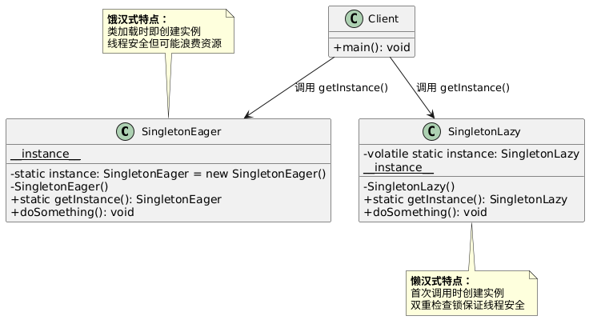
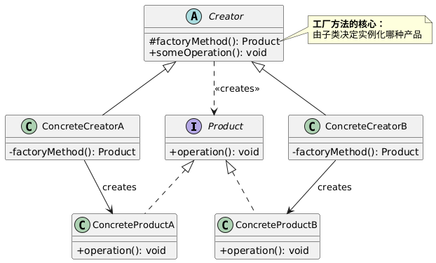
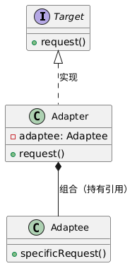
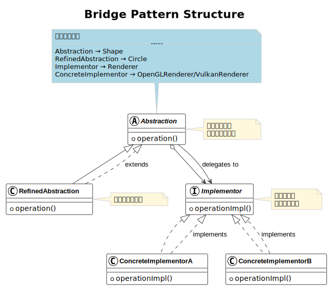

https://blog.csdn.net/liang19890820/article/details/66974516
# 设计模式（23）
## 设计模式的类型
- 创建者模式(creational Patterns): 用于创建对象，以便它们可以从实现系统分离出来
- 结构型模式(structural Patterns): 用于不同对象之间形成大型对象结构
- 行为型模式(Behavioral Patterns): 用于管理对象之间的算法、、关系和职责

## 单例模式：
以下是对C++单例模式面试常见问题的完整答案整理，包含概念解释、代码实现和关键要点：

### 一、基础概念与实现
1. **什么是单例模式？核心目的是什么？**  
   - **答案**：确保一个类只有一个实例，并提供全局访问点。核心目的是：
     - 控制资源访问（如配置管理器、线程池）
     - 避免重复创建对象的开销
     - 保证全局状态的一致性

---

### 二、基础实现
2. **手写饿汉式单例**  
```cpp
class Singleton {
private:
    static Singleton instance;  // 静态成员初始化
    Singleton() {}              // 私有构造函数
    
public:
    Singleton(const Singleton&) = delete;             // 禁用拷贝
    Singleton& operator=(const Singleton&) = delete;  // 禁用赋值
    
    static Singleton& getInstance() {
        return instance;
    }
};
// 类外初始化（程序启动时创建）
Singleton Singleton::instance;
```
**特点**：线程安全但可能浪费资源

3. **手写懒汉式单例（C++11线程安全版）**  
```cpp
class Singleton {
private:
    Singleton() {}
    
public:
    Singleton(const Singleton&) = delete;
    Singleton& operator=(const Singleton&) = delete;
    
    static Singleton& getInstance() {
        static Singleton instance;  // C++11保证线程安全
        return instance;
    }
};
```
**特点**：按需创建，C++11标准保证静态局部变量线程安全

---
### 总结对比表
| **特性**       | **饿汉式**                          | **懒汉式**                          |
|----------------|------------------------------------|------------------------------------|
| **创建时机**   | 程序启动时                         | 第一次调用`getInstance()`时        |
| **线程安全**   | 天然安全                           | 需额外措施（锁/局部静态变量）      |
| **资源占用**   | 可能浪费（未使用也创建）           | 按需创建，节约资源                 |
| **实现复杂度** | 简单                               | 相对复杂（需处理线程安全）         |
| **首次访问性能** | 无延迟（已创建）                 | 有延迟（需初始化）                 |
| **适用场景**   | 小对象、确定会使用、启动不敏感     | 大对象、可能不使用、内存敏感       |
> 💡 **现代C++推荐**：优先使用**懒汉式（局部静态变量）**，因为C++11标准明确保证其线程安全性，实现简洁且高效。
---
单例模式UML图例：

---
## 工厂模式：
### C++ 工厂模式面试高频问题及答案整理

---

#### **1. 什么是工厂模式？核心思想是什么？**
**答**：  
工厂模式是一种**创建型设计模式**，将对象的创建逻辑封装在工厂类中，客户端不直接调用构造函数，而是通过工厂接口获取对象实例。  
**核心思想**：  
- **解耦**：分离对象创建与使用逻辑  
- **封装变化**：当创建逻辑变化时，只需修改工厂类  
- **统一入口**：通过统一接口创建多种相关对象  

---

#### **2. 工厂模式的三种类型及区别？**
| **类型**         | **特点**                                                                 | **适用场景**                     |
|------------------|--------------------------------------------------------------------------|----------------------------------|
| **简单工厂**     | 一个工厂类创建所有产品，通过参数区分类型                                 | 产品类型少且固定                 |
| **工厂方法**     | 每个产品对应一个工厂子类，遵循开闭原则                                   | 需要扩展新产品                   |
| **抽象工厂**     | 创建多个产品族的对象（一组相关对象），强调产品间的约束关系               | 需要保证产品兼容性（如UI跨平台） |

---

#### **3. 简单工厂模式示例代码**
```cpp
// 产品基类
class Product {
public:
    virtual void Operation() = 0;
    virtual ~Product() = default;
};

// 具体产品A
class ConcreteProductA : public Product {
public:
    void Operation() override { cout << "Product A\n"; }
};

// 简单工厂
class SimpleFactory {
public:
    static Product* CreateProduct(const string& type) {
        if (type == "A") return new ConcreteProductA();
        if (type == "B") return new ConcreteProductB(); // 扩展新产品需修改此处
        return nullptr;
    }
};

// 客户端
Product* p = SimpleFactory::CreateProduct("A");
p->Operation();
```
**缺点**：违反开闭原则（新增产品需修改工厂类）

---

---
## 适配器模式：
---
> “适配器模式是一种结构型设计模式，主要用于解决接口不兼容的问题，让原本不能一起工作的类可以协作。它的核心是**引入一个适配器类作为中间层**。
>
> **它包含三个关键角色：**
> 1.  **目标接口（Target）：** 这是客户端期望使用的接口。
> 2.  **被适配者（Adaptee）：** 这是需要被复用的、但接口不兼容的现有类。
> 3.  **适配器（Adapter）：** 它实现目标接口，并持有被适配者的引用。当客户端调用目标接口的方法时，适配器内部会调用被适配者的相应方法来完成工作。
>
> **举个例子：** 就像需要一个 USB-C 转 MicroUSB 的转换头（适配器），才能让新的 USB-C 接口电脑（客户端/目标）使用旧的 MicroUSB 接口设备（被适配者）。
>
>
> **适配器模式的典型应用场景包括：** 集成第三方库、复用遗留代码、统一不同组件的接口（比如各种日志框架的适配器）等。
>
> **它的优点主要是解耦客户端与被适配者、复用现有代码、符合开闭原则。缺点是会稍微增加系统复杂性，如果接口本身能统一则不必使用。”


---

## 桥接模式
在 C++ 面试中回答 **Bridge 模式（桥接模式）** 时，需要清晰说明其核心思想、结构、实现要点和应用场景。以下是结构化回答建议：

---

### **1. 核心定义**
> **Bridge 模式是一种结构型设计模式，它将抽象部分（Abstraction）与实现部分（Implementation）分离，使二者可以独立变化。**  
> 通过组合代替继承，避免因多层继承导致的类爆炸问题，提高系统的可扩展性。

---

### **2. 解决的问题**
- **场景**：当一个类有多个维度的变化（如平台类型 × 功能类型），使用继承会导致类数量指数级增长（`M×N` 个类）。
- **痛点**：紧耦合的继承结构难以扩展新维度，违反开闭原则。

**示例问题**：  
假设开发跨平台图形库，支持不同形状（圆形、方形）和渲染方式（OpenGL、Vulkan）。  
❌ 错误做法：为每个组合创建子类（`OpenGLCircle`, `VulkanCircle`, `OpenGLSquare`...） → 类膨胀。

---

### **3. Bridge 模式结构**
```plaintext
          +---------------------+        +----------------------+
          |     Abstraction     |<>----->|    Implementor       |
          +---------------------+        +----------------------+
          | + operation()       |        | + operationImpl()    |
          +---------------------+        +----------------------+
                     ▲                              ▲
                     |                              |
          +---------------------+        +----------------------+
          | RefinedAbstraction  |        | ConcreteImplementorA |
          +---------------------+        +----------------------+
          | + operation() {     |        | + operationImpl()    |
          |   impl->operationImpl(); }   +----------------------+
          +---------------------+        | ConcreteImplementorB |
                                         +----------------------+
                                         | + operationImpl()    |
                                         +----------------------+
```

| 角色                | 职责                                 | C++ 实现要点              |
|---------------------|--------------------------------------|--------------------------|
| **Abstraction**     | 定义高层抽象接口，持有实现层的引用   | 抽象类/接口，包含 `Implementor*` |
| **RefinedAbstraction** | 扩展抽象接口，添加特定功能         | 继承自 `Abstraction`      |
| **Implementor**     | 定义实现层接口                     | 抽象类/接口                |
| **ConcreteImplementor** | 具体实现（如不同平台/算法）      | 实现 `Implementor` 接口   |

---

### **4. 代码示例（图形库案例）**
```cpp
// 实现层接口：渲染引擎
class Renderer {
public:
    virtual ~Renderer() = default;
    virtual void renderCircle(float x, float y, float radius) = 0;
};

// 具体实现：OpenGL
class OpenGLRenderer : public Renderer {
public:
    void renderCircle(float x, float y, float radius) override {
        std::cout << "OpenGL: Circle at (" << x << "," << y << ") r=" << radius << "\n";
    }
};

// 具体实现：Vulkan
class VulkanRenderer : public Renderer {
public:
    void renderCircle(float x, float y, float radius) override {
        std::cout << "Vulkan: Circle at (" << x << "," << y << ") r=" << radius << "\n";
    }
};

// 抽象层：图形基类
class Shape {
protected:
    Renderer* renderer; // 桥接关键：持有实现层引用
public:
    Shape(Renderer* r) : renderer(r) {}
    virtual ~Shape() = default;
    virtual void draw() = 0;
};

// 扩展抽象：圆形
class Circle : public Shape {
    float x, y, radius;
public:
    Circle(Renderer* r, float x, float y, float r) 
        : Shape(r), x(x), y(y), radius(r) {}
    
    void draw() override {
        renderer->renderCircle(x, y, radius); // 委托给实现层
    }
};

// 使用示例
int main() {
    OpenGLRenderer opengl;
    VulkanRenderer vulkan;

    Circle circle1(&opengl, 10, 20, 5);
    circle1.draw(); // 输出: OpenGL: Circle at (10,20) r=5

    Circle circle2(&vulkan, 30, 40, 15);
    circle2.draw(); // 输出: Vulkan: Circle at (30,40) r=15

    return 0;
}
```

---
---
### 5. UML示例



---


## 观察者模式
### C++ 面试：观察者模式详解

#### **1. 核心概念**
观察者模式（Observer Pattern）是一种**行为型设计模式**，定义了对象间**一对多的依赖关系**。当一个对象（Subject）的状态发生变化时，所有依赖它的对象（Observers）会自动收到通知并更新。

#### **2. 关键角色**
| **角色**         | **作用**                                                                 |
|------------------|--------------------------------------------------------------------------|
| **Subject**      | 主题类，维护观察者列表，提供添加/删除观察者的接口，状态变化时通知观察者。 |
| **Observer**     | 观察者接口，定义更新方法（`update()`）。                                |
| **ConcreteSubject** | 具体主题类，存储状态，状态改变时触发通知。                             |
| **ConcreteObserver** | 具体观察者类，实现更新逻辑（响应主题变化）。                          |

#### **3. C++ 实现示例**
```cpp
#include <iostream>
#include <vector>
#include <algorithm>

// 观察者接口
class Observer {
public:
    virtual ~Observer() = default;
    virtual void update(float temperature) = 0; // 更新方法
};

// 主题接口
class Subject {
public:
    virtual void attach(Observer* o) = 0;    // 注册观察者
    virtual void detach(Observer* o) = 0;    // 移除观察者
    virtual void notify() = 0;               // 通知观察者
};

// 具体主题：气象站
class WeatherStation : public Subject {
private:
    std::vector<Observer*> observers;        // 观察者列表
    float temperature;                       // 状态数据
public:
    void setTemperature(float temp) {
        temperature = temp;
        notify(); // 状态变化时通知所有观察者
    }

    void attach(Observer* o) override {
        observers.push_back(o);
    }

    void detach(Observer* o) override {
        observers.erase(
            std::remove(observers.begin(), observers.end(), o),
            observers.end()
        );
    }

    void notify() override {
        for (Observer* o : observers) {
            o->update(temperature); // 调用观察者的更新方法
        }
    }
};

// 具体观察者：手机显示
class PhoneDisplay : public Observer {
public:
    void update(float temperature) override {
        std::cout << "[Phone] 温度更新: " << temperature << "°C\n";
    }
};

// 具体观察者：电视显示
class TVDisplay : public Observer {
public:
    void update(float temperature) override {
        std::cout << "[TV] 当前温度: " << temperature << "°C\n";
    }
};

// 使用示例
int main() {
    WeatherStation station;
    PhoneDisplay phone;
    TVDisplay tv;

    station.attach(&phone); // 注册手机观察者
    station.attach(&tv);    // 注册电视观察者

    station.setTemperature(25.5f); // 触发通知
    station.setTemperature(30.0f); // 再次触发通知

    station.detach(&tv);           // 移除电视观察者
    station.setTemperature(22.0f); // 只有手机会收到通知

    return 0;
}
```

#### **4. 输出结果**
```
[Phone] 温度更新: 25.5°C
[TV] 当前温度: 25.5°C
[Phone] 温度更新: 30°C
[TV] 当前温度: 30°C
[Phone] 温度更新: 22°C
```

---
